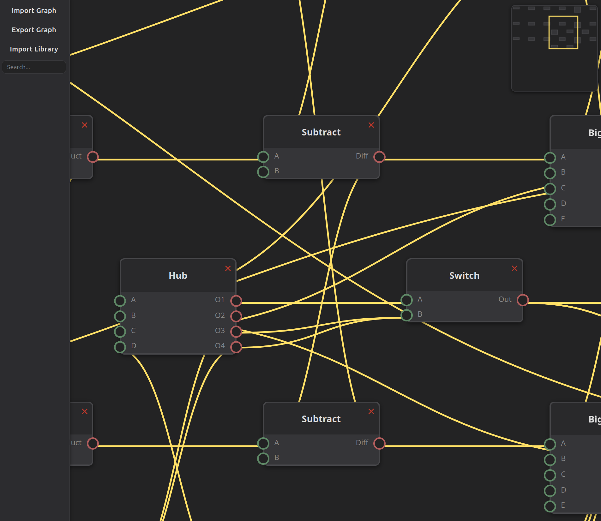

# Node Graph Editor

A minimal interactive node-graph editor for the browser. Try it: [Node_Editor](https://x0sig.github.io/node_editor/)

---

## Features

- **Visual Node-Based Editing:**  
  Create, move, and delete nodes visually on a workspace.
- **Custom Node Library:**  
  Define node types (inputs, outputs, function) in a JSON library and add them to your graph.
- **Edge Editing:**  
  Connect nodes via edges between outputs and inputs. Delete edges by clicking on them.
- **Import/Export Graphs:**  
  Save and load complete graphs (nodes and edges) as JSON.
- **Interactive SVG Rendering:**  
  All nodes and edges are rendered as SVG for smooth interaction and visuals.

---


## Images

Here are example screenshots of the Node Graph Editor in action:




---

## Data Formats

### **Graph Format (Import/Export)**
```json
{
  "nodes": [
    {
      "id": 2,
      "name": "Multiply",
      "x": 761.05,
      "y": 165.23,
      "fn": "some cool function",
      "inputs": ["A", "B"],
      "outputs": ["Product"]
    }
    // ... more nodes
  ],
  "edges": [
    {
      "from": { "nodeId": 2, "index": 0 },
      "to":   { "nodeId": 6, "index": 0 }
    }
    // ... more edges
  ]
}
```

### **Node Library Format**
```json
[
  { "name": "Add", "fn": "some cool math shit", "inputs": [], "outputs": ["Sum"] },
  { "name": "Multiply", "fn": "some cool math shit", "inputs": ["A", "B"], "outputs": ["Product"] },
  { "name": "BigNode", "fn": "some cool math shit", "inputs": ["A", "B", "C", "D", "E"], "outputs": ["R1", "R2", "R3", "R4"] }
]
```

---

## Usage

1. **Load or Import a Graph:**  
   Load a JSON graph from file.
2. **Edit Nodes:**  
   - Drag nodes to move them.
   - Click the close (×) button to delete.
   - Add nodes from the library by dragging onto the workspace.
3. **Edit Edges:**  
   - Drag from an output port to an input port to create an edge.
   - Click on an edge to highlight and remove it.
4. **Export Graph:**  
   Save your graph as JSON for later use.

---

## Customization

- **Node Types:**  
  Extend the node library JSON to add new node types.
- **Functions:**  
  Each node can have a custom function description (`fn`).
- **Inputs/Outputs:**  
  Node ports are defined per node type.

---

## Technical Notes

- All rendering is done with SVG for maximum interactivity and clarity.
- Edges are interactive: hover to highlight, click to remove.
- The editor is designed for extensibility and easy integration.

---

## License

MIT
